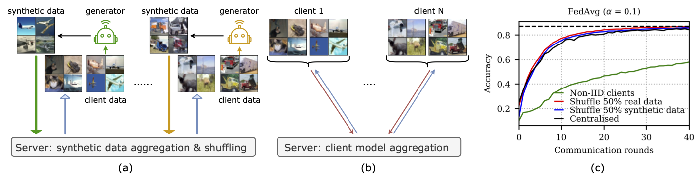

### Synthetic data shuffling in federated learning
This repository provides the implementation for our paper [Synthetic data shuffling accelerates the convergence of federated learning under data heterogeneity](https://arxiv.org/pdf/2306.13263.pdf). We experimentally show that shuffling locally generated synthetic datasets can accelerate the convergence of multiple federated learning algorithms under high data heterogeneity. Note, this code can also be used to reproduce the experiments from the paper [Partial Variance Reduction improves Non-Convex Federated learning on heterogeneous data](https://arxiv.org/pdf/2212.02191.pdf). 




#### Requirement 
```bash
git clone https://github.com/lyn1874/fedssyn.git
cd fedssyn
conda env create -f fedssyn.yaml
conda activate torch_dl
```

#### Data preparation

The real CIFAR10 and CIFAR100 data are downloaded and stored under `../image_dataset/` by default. To change this, please modify the `data_path` argument in `configs.conf.py` file.

We generate the synthetic CIFAR10 and CIFAR100 dataset following a publically available implementation from https://github.com/VSehwag/minimal-diffusion. We split the data following the same routine as described in function `define_data_loader()` from `data.create_dataset.py`. We train a local DDPM with a learning rate of 0.0001, 1000 diffusion steps, 256 batch size, and 500 epochs. These hyperparameters are the same for all the experiments. When the training is done, each client simulates $\frac{50000}{N}$ synthetic images together with their labels, where $N$ is the number of clients. 


#### Path preparation
Define the corresponding path in function `get_replace_for_init_path()` and `get_path_init()` in file `utils.utils.py`

#### Training
We train fedavg using the following command
```bash
./run_fedavg_scaffold_fedpvr.sh gpu_device data '0' N location aggregation data_align 
gpu_device: int
data: cifar10/cifar100
N: int, number of devices
location: str, defines the location for saving the experiment
aggregation: fed_avg/scaffold/fed_pvr 
data_align: none/add_fake_diffusion_sync_local_generator/add_fake_diffusion_sync_local_generator_without_shuffle
```
For other aggregation methods, please have a look at file `run_fedprox.sh` and `run_fed_dyn.sh`.


#### Citation
If you use this code, please cite:

```
@misc{li2023synthetic,
      title={Synthetic data shuffling accelerates the convergence of federated learning under data heterogeneity}, 
      author={Bo Li and Yasin Esfandiari and Mikkel N. Schmidt and Tommy S. Alstrøm and Sebastian U. Stich},
      year={2023},
      eprint={2306.13263},
      archivePrefix={arXiv},
      primaryClass={cs.LG}
}
```